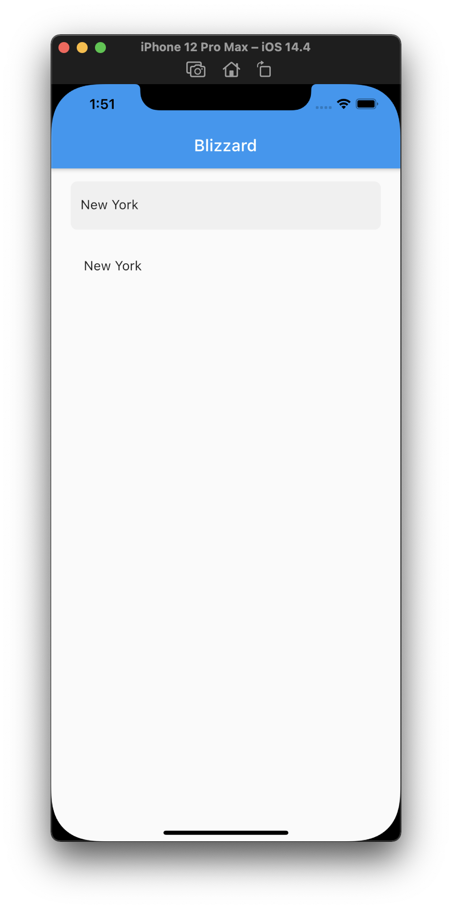

# blizzard [](https://codecov.io/gh/gray419/blizzard)

A Weather app powered by the [Metaweather API](https://www.metaweather.com/api/).

## Requirements
---
- Flutter >= 2.0
- Dart >= 2.12

## Running the App
---
To run the app use the following commands:
```sh
$ git clone git@github.com:gray419/blizzard.git
$ cd blizzard
$ open -a simulator
$ flutter run
```

## Screenshots
---
<p float="left">


</p>
