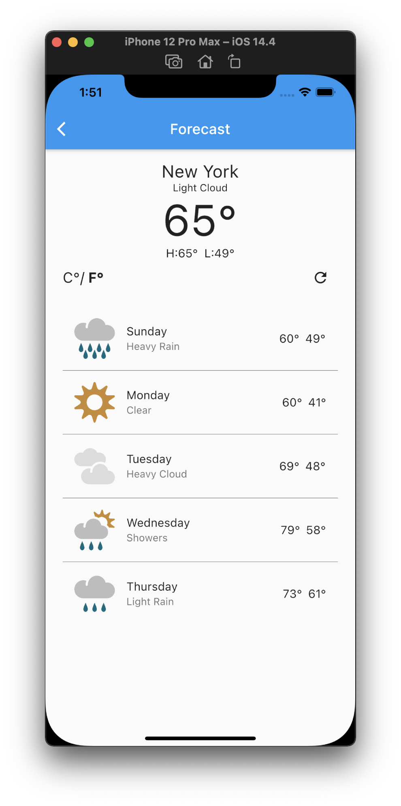

# blizzard [](https://codecov.io/gh/gray419/blizzard)

A Weather app powered by the [Metaweather API](https://www.metaweather.com/api/).

# Requirements
- Flutter >= 2.0
- Dart >= 2.12

# Run
- Open an iOS/Android simulator
- In your terminal run:
```
git clone git@github.com:gray419/blizzard.git
cd blizzard
flutter run
```
# Screenshots


